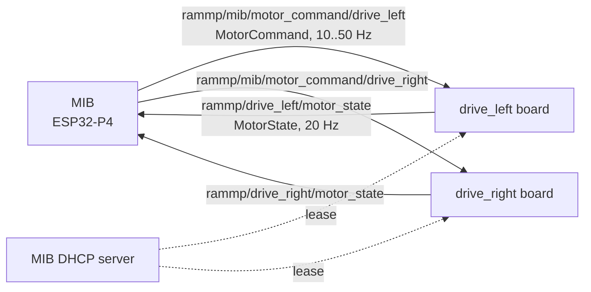
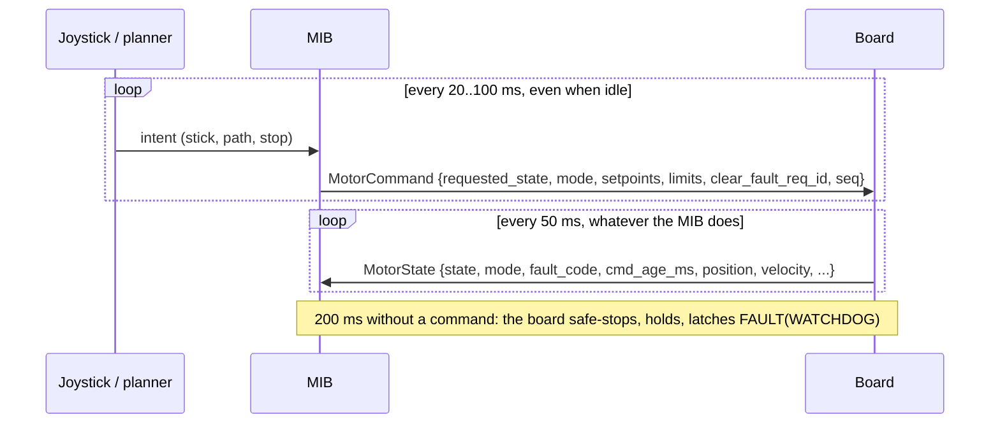
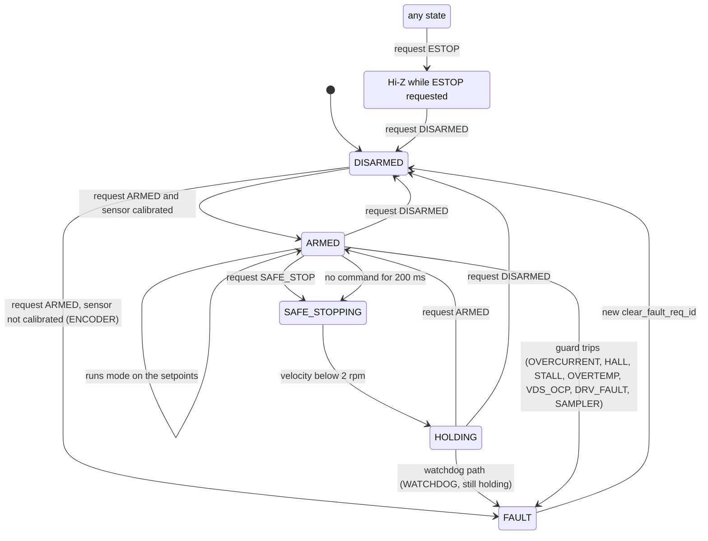
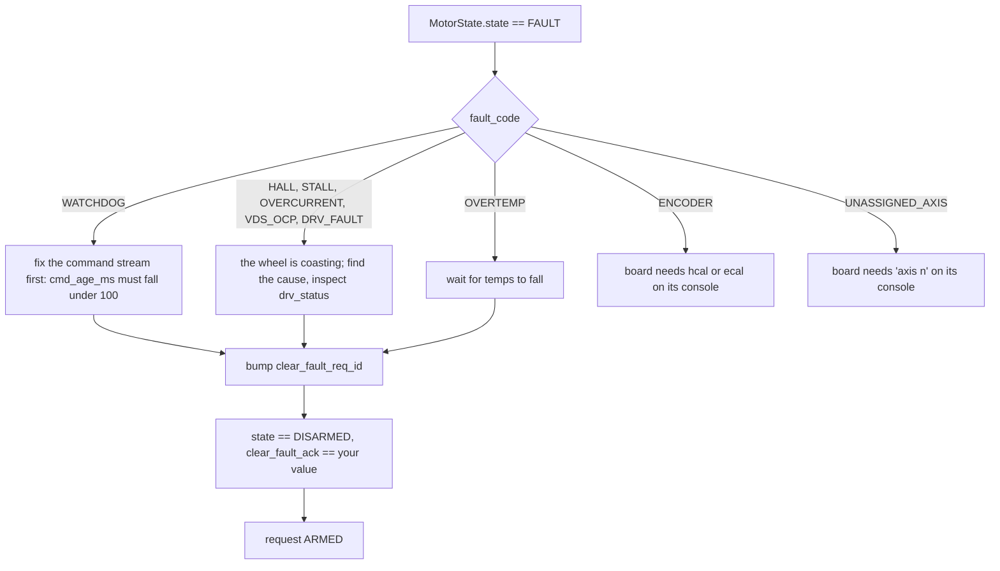
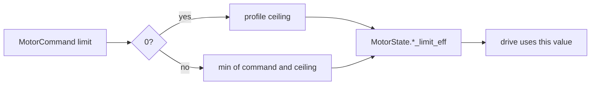

# PACE RACER motor API

How to drive a PACE RACER wheel over ATOS. The wire types are
`components/rammp_rtps_messages/include/messages/motor_message.hpp`; this
document is the behaviour behind them. The firmware that implements it lives in
`rammp-org/pace-racer-fw`, `components/pace-racer-board/atos-drive`.

Status: verified on the bench 2026-09-26 on a NineBot S wheel, halls only, one
board. Not yet run with two boards or under load.

## One wheel, two topics

Each board is one wheel. It reads one topic and writes one topic. Nothing else
crosses the wire: no configuration, no PID, no services.

| direction | topic | type | rate |
| --- | --- | --- | --- |
| MIB to board | `rammp/mib/motor_command/<axis>` | `rammp::MotorCommand`, 28 bytes | streamed by the MIB, 10 to 50 Hz |
| board to MIB | `rammp/<axis>/motor_state` | `rammp::MotorState`, 80 bytes | 20 Hz, always, armed or not |

`<axis>` is `front_caster_left`, `front_caster_right`, `drive_left` or
`drive_right` (`RAMMP_AXIS_TABLE`, `rammp::kAxes`). A board only deserializes
its own command topic.



The transport is best effort with no durability. Every command therefore
carries the complete desired state, so a lost packet costs nothing: the next
one repeats it. The one exception is the fault clear, which is a counter, so a
repeated packet cannot clear a fault twice.

The C++ structs are the wire layout. Use the header with espp's reflection on
both ends; do not transcribe offsets. `MotorState` has 2 bytes of XCDR1 padding
before `cmd_age_ms`.

## The loop you write



Two things the MIB should assert on every `MotorState`:

- `state == ARMED` while it believes it is driving. Any other state means the
  board is ignoring `mode` and the setpoints.
- `cmd_age_ms < 100`. It reads 20 to 50 ms on a healthy stream; 65535 means the
  board has never heard from you.

Record every `MotorState`. At 80 bytes and 20 Hz a wheel is 1.6 kB/s, and every
incident becomes a replay instead of a guess.

## MotorCommand

Send the whole struct every time.

| field | type | meaning |
| --- | --- | --- |
| `seq` | uint8 | your counter; echoed back as `last_cmd_seq` |
| `requested_state` | enum | `DISARMED`, `ARMED`, `SAFE_STOP`, `ESTOP`. The board converges to it every 10 ms tick |
| `mode` | enum | `COAST`, `TORQUE`, `VELOCITY`, `POSITION`, `HOLD`. Ignored unless ARMED |
| `position` | float, rad | POSITION setpoint at the shaft, multiturn, CCW positive. Every new value is a new target, no profile |
| `velocity` | float, rad/s | VELOCITY setpoint at the shaft |
| `torque` | float, N.m | TORQUE setpoint at the shaft |
| `torque_limit` | float, N.m | 0 = profile ceiling. Clamps `torque`, caps current in every mode |
| `vel_limit` | float, rad/s | 0 = profile ceiling. Clamps the velocity setpoint, caps position moves, rolls torque off above it in every mode |
| `accel_limit` | float, rad/s^2 | 0 = step, or the profile's acceleration ceiling where one is set. Ramps the velocity setpoint and the safe stop |
| `clear_fault_req_id` | uint8 | a counter. Bump it once to clear a fault; the board acks the value it acted on |

Units are SI at the shaft. Pole pairs, gearing and Kt are the board's business.

A joystick controller sends `ARMED` + `VELOCITY` + the stick value, limits at
0, counter unchanged. Stick released: `SAFE_STOP`. Done for the day: `DISARMED`.

## What each mode does

| mode | setpoint used | the board runs | notes |
| --- | --- | --- | --- |
| `COAST` | none | bridge Hi-Z, wheel free | the mode to send while ARMED with nothing to do |
| `TORQUE` | `torque` | current loop at `torque / Kt` | above `vel_limit` torque rolls off and reverses: it cannot run away |
| `VELOCITY` | `velocity` | speed loop, setpoint ramped at `accel_limit` | the mode the chair and the rover drive in |
| `POSITION` | `position` | position P loop feeding the speed loop, capped at `vel_limit` | on halls, position is 4 deg steps on 15 pole pairs |
| `HOLD` | none | position hold at the shaft's current angle | reduced torque cap; also what SAFE_STOP ends in |

## The state machine



| you request | from | the board does |
| --- | --- | --- |
| `ARMED` | DISARMED, HOLDING | uncoasts and runs `mode`. Refused with `FAULT(ENCODER)` if the commutation sensor is not calibrated |
| `SAFE_STOP` | ARMED | ramps velocity to zero at `accel_limit` (200 rpm/s if 0), then HOLDING: active position hold under a reduced torque cap. It stays held until you ask for something else |
| `DISARMED` | anything | Hi-Z, wheel free |
| `ESTOP` | anything | Hi-Z now, and for as long as you keep requesting it |
| nothing for 200 ms | ARMED | the SAFE_STOP path, then `FAULT(WATCHDOG)` while still holding |

Two consequences worth designing around. A chair that loses its MIB ends up
held, not rolling. And SAFE_STOP is not a pause: to move again you request
ARMED, which is allowed from HOLDING.

## Faults and how to clear them

A fault latches until `clear_fault_req_id` changes. The board then goes to
DISARMED and reports the counter value in `clear_fault_ack`; request ARMED from
there. Clearing when not faulted is harmless and still acks.



| fault | cause | the wheel |
| --- | --- | --- |
| `WATCHDOG` | no command for 200 ms | safe-stopped, then held |
| `OVERCURRENT` | phase current over the board trip | unloaded, coast |
| `VDS_OCP`, `DRV_FAULT` | gate driver tripped; bits in `drv_status` | bridge off |
| `OVERTEMP` | a board temperature over its limit; see `temps` | unloaded, coast |
| `ENCODER` | arm requested with an uncalibrated commutation sensor | never energized |
| `SAMPLER` | current sampling fell behind and disabled itself | coast |
| `HALL` | illegal hall input for 50 ms: an open, shorted or unpowered line | unloaded, coast, within one sample |
| `STALL` | speed or position mode pushing at half the cap with no hall motion for 0.5 s | unloaded, coast, about 2 s after a wheel is blocked |
| `UNASSIGNED_AXIS` | no axis in NVS | not on the network |

## Limits and profiles

Every limit in a command is clamped to the board's profile, and the value in
force comes back in `*_limit_eff`. Read those rather than assuming.



| limit | 0 means | the drive does |
| --- | --- | --- |
| `torque_limit` | ceiling | caps current in every mode; clamps `torque` |
| `vel_limit` | ceiling | clamps the velocity setpoint and position moves; in every mode a governor rolls torque off above it and brakes, so a wound-up controller or a torque command cannot run a wheel away |
| `accel_limit` | step, or the ceiling on profiles that set one | ramps the velocity setpoint and the safe stop |

A profile is a block of compile-time constants in the firmware,
`main/motor_params.hpp` in `atos-drive`, selected with `idf.py
-DATOS_MOTOR=<profile> build`. It holds the motor (pole pairs, Kt, R, L,
flux), the current-loop tune, and the ceilings. The ceilings exist so that
nothing on the network can raise them; the integration team owns them.

| profile | motor | speed ceiling | current ceiling | accel ceiling |
| --- | --- | --- | --- | --- |
| default | NineBot S on the dyno | 520 rpm (54.5 rad/s) | 30 A (18 N.m) | none |
| `flatbot` | NineBot S on the office rover | 60 rpm (6.28 rad/s) | 10 A (6 N.m) | 120 rpm/s (12.6 rad/s^2) |
| `hub20` | ZLtech hub on rammp 1.5 | 180 rpm | 22 A | none |

The flatbot numbers are a starting point, not a spec. The intended workflow:
characterize the robot with them, decide what is safe for it, edit the
profile, reflash, and only then tune feel with the per-command limits from
the MIB. Per-command limits can only tighten a ceiling, so tuning from the
MIB can never make the robot faster or stronger than its profile.

## What you cannot do

- Raise a ceiling from the network. Edit the profile and reflash.
- Change gains, PID or calibration from the network. Console and NVS only.
- Send a trajectory. Stream setpoints; the board tracks each one as fast as
  the limits allow. Profiling is the MIB planner's job.
- Rely on a single command. Anything you send once may be lost; keep
  streaming the state you want.
- Pause. SAFE_STOP ends in an active hold; ARMED resumes.
- Coast on a hill after a safe stop. If you want the wheel free, request
  DISARMED and mean it.

## MotorState

| field | type | what to watch |
| --- | --- | --- |
| `state`, `mode`, `fault_code` | enums | the three that say whether you are being obeyed |
| `cmd_age_ms` | uint16 | time since the last command; 65535 = never |
| `last_cmd_seq`, `clear_fault_ack` | uint8 | your `seq` and your clear counter as the board saw them |
| `position` | float, rad | shaft, multiturn from boot, CCW positive |
| `velocity` | float, rad/s | shaft, from the commutation sensor. On halls a 5 Hz tracking loop |
| `torque_est`, `iq`, `id` | float | torque from Kt times `iq`; `id` should sit near zero |
| `vbus`, `ibus_est`, `temps[4]` | float | bus volts, an estimate of bus current, board temperatures in C |
| `torque_limit_eff`, `vel_limit_eff`, `accel_limit_eff` | float | the limits in force |
| `drv_status` | uint16 | raw DRV8353 fault bits, meaningful with `VDS_OCP` and `DRV_FAULT` |
| `api_version`, `fw_version`, `axis_id`, `uptime_ms`, `seq` | ints | identity and liveness |

## Discovery, and what the MIB should do about it

The board asks the MIB for a DHCP lease with hostname `pace-racer-<axis>`,
starts its RTPS participant on the leased address, and publishes from then on.
Two findings from the bench that the MIB should design around:

- A switch with IGMP snooping and no querier forwarded the host's multicast to
  the board but not the board's to the host, so SPDP discovery failed one way
  and everything looked dead. The MIB is the DHCP server and knows every
  board's address from its lease table; discovering boards by unicast from
  that table is the robust design.
- espp on the board keeps the reader proxy of every host participant it ever
  matched, and they do not expire. Each MIB restart adds one more copy of every
  `MotorState` the board sends, and the proxy table is fixed size. This needs a
  fix in espp before the chair depends on MIB restarts.

The MIB also owns the deadman above this API: joystick released means
`SAFE_STOP`; joystick board silent means stop requesting `ARMED`, so both
wheels watchdog into a hold within 200 ms.

## Bringing up a board

Once per board, on its USB console, before it will arm:

```
axis 2      # 0 front_caster_left, 1 front_caster_right, 2 drive_left, 3 drive_right
fb hall     # what it commutates on: hall (default) or enc
hcal 6      # hall table, spun both ways on a free wheel; ecal 4 for an encoder
```

`axis` shows what is saved, `fb` shows the sensor and whether it is calibrated,
`atos` shows the link, the state machine and the counters. A host-side stand-in
that streams commands from stdin and prints state is in
`pace-racer-fw/components/pace-racer-board/atos-drive/tests/host_mib`.
